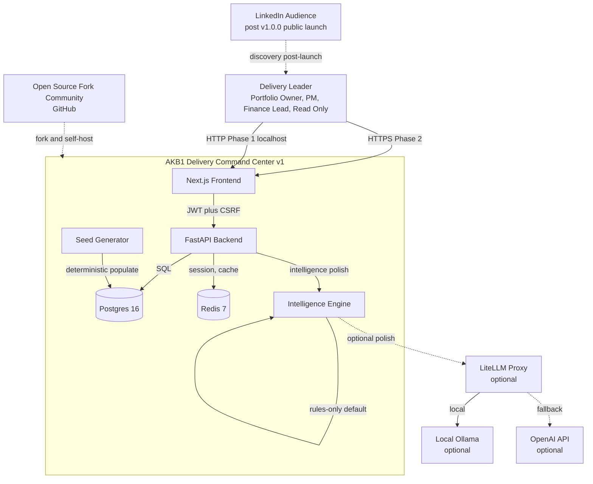
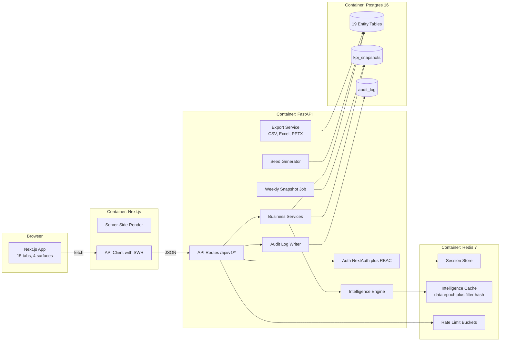
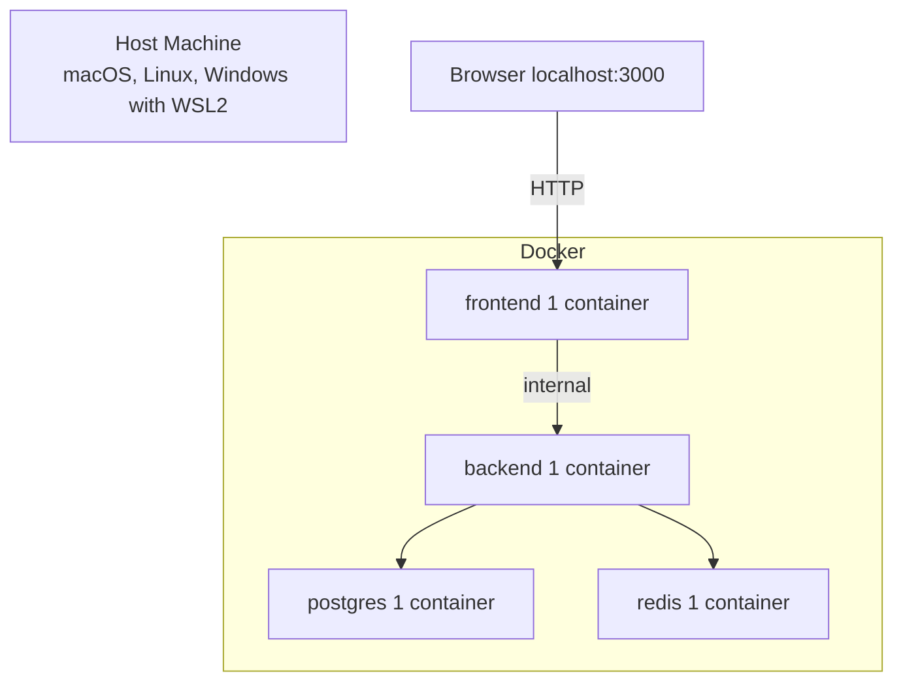
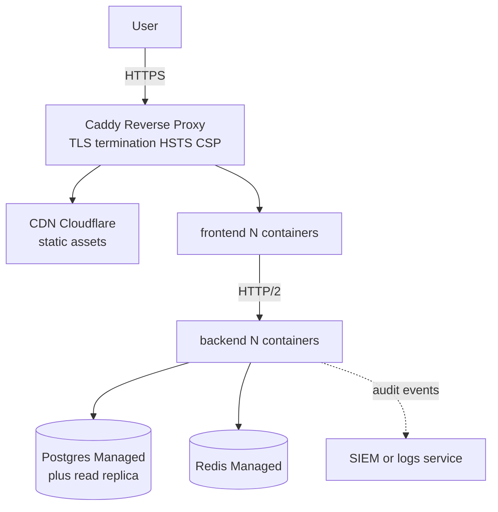

# 01_Enterprise_Architecture_Overview.md
### AKB1 Delivery Command Center v1 | Enterprise Architecture Overview | Created: 2026-04-24

> System context, component diagram, deployment topology, technology inventory. The single architecture anchor that links every other architecture document. Inherits decisions D-001 through D-018.

---

## 1. Executive summary

AKB1 Delivery Command Center is a self-hostable portfolio intelligence platform built on Next.js 14, FastAPI, Postgres 16, and Redis 7, packaged in Docker. Fifteen role-gated tabs with a three-zone intelligence layer on every tab. Open source AGPL-3 from v1.0.0. Phase 1 targets single-tenant self-host. Phase 2 adds multi-tenant hosted deploy.

## 2. System context (C4 level 1)

## 3. Component diagram (C4 level 2)

## 4. Deployment topology

### 4.1 Phase 1: Self-host (laptop or single VM)

Single `docker compose up`. No TLS, no reverse proxy. Operator responsibility for local security.

### 4.2 Phase 2: Hosted (Fly.io, Render, Railway, K8s)

Horizontal scale via container replicas. Managed Postgres and Redis for durability. CDN for static assets. HTTP/2 keepalive for lower latency.

## 5. Technology inventory

| Layer | Technology | Version | Purpose |
|-------|-----------|---------|---------|
| Runtime | Docker plus Docker Compose | 26+, v2.27+ | Containerisation and orchestration |
| Frontend | Next.js | 14 (App Router) | SSR, routing, React server components |
| Frontend | React | 18 | UI |
| Frontend | Tailwind CSS | 3.4 (local build in production) | Styling |
| Frontend | Shadcn UI | latest | Component primitives |
| Frontend | Recharts | 2.x | Charts |
| Frontend | Lucide React | 0.383 | Icons |
| Frontend auth | NextAuth | v5 | Auth flow, session management |
| Backend runtime | Python | 3.12 | Language |
| Backend framework | FastAPI | latest | API server |
| Backend ORM | SQLAlchemy | 2.x async | Data access |
| Backend migrations | Alembic | latest | Schema management |
| Backend DB driver | asyncpg | latest | Postgres async |
| Backend validation | Pydantic | v2 | Schemas |
| Database | Postgres | 16 | Primary datastore |
| Cache | Redis | 7 | Sessions, cache, rate limit |
| LLM (optional) | Ollama | current | Local LLM |
| LLM proxy (optional) | LiteLLM | current | OpenAI-compatible routing |
| LLM fallback (optional) | OpenAI API | v1 | Hosted LLM |
| Reverse proxy (Phase 2) | Caddy | 2.x | TLS, HSTS, CSP |
| Testing backend | pytest | 8+ | Unit, integration, contract |
| Testing frontend | Vitest | 2+ | Unit, component |
| Testing E2E | Playwright | 1.45+ | Browser automation |
| Security scan | trivy, bandit | latest | CVE, code security |
| Observability | Prometheus, OpenTelemetry | latest | Metrics, tracing |
| Load test | Locust | 2.x | Performance benchmark |

## 6. Architectural principles

| Principle | How enforced |
|-----------|--------------|
| Stateless app containers | No local disk writes in frontend or backend containers. All state in Postgres or Redis |
| Single source of truth | OpenAPI spec generated from FastAPI is the contract. CI diffs PRD tables against it |
| Defense in depth | RBAC at route, RLS at row (Phase 2), audit at action, CSP at browser, rate limit at edge |
| Deterministic seeds | Fixed numpy seed. Byte-identical across machines. No test depends on wall-clock randomness |
| Cache correctness over freshness | Data epoch invalidates cache on every write. TTL is a safety net, not primary |
| Role-scoped primary navigation | Maximum 5 primary tabs per role. All 15 accessible via More menu |
| Intelligence layer as first-class | Every tab has rules file. Every tab passes voice test. Rules-only default |
| Accessibility not optional | axe-core zero violations is a merge gate |
| No em dashes or emojis | Pre-commit hook enforces |

## 7. Decision anchors

| ID | Decision | Document |
|----|----------|----------|
| D-001 to D-006 | Project initiation, name, stack, scope, visibility, location | DECISION_LOG |
| D-007, D-018 | Colour palette (Option D) | Design Foundations |
| D-008 | Tailwind CSS approach | Design Foundations |
| D-009, D-010 | Programme seed and narrative arc | Design Foundations |
| D-011, D-012 | Design Foundations sign-off, git delegation | DECISION_LOG |
| D-013 | RAID taxonomy Risk Assumption Issue Dependency | Data Model PRD |
| D-014 | Exports in v1.0.0 | Exports PRD |
| D-015 | Role-scoped 5-tab primary nav | Design Foundations section 5.3 |
| D-016 | SOC2-lite posture | Security PRD, Security Architecture |
| D-017 | LLM injection policy and rules-only default | Intelligence Layer PRD |

## 8. Out of scope for v1.0.0

Real system integrations (Jira, Salesforce, Workday, ServiceNow, Azure DevOps). Formal SOC2 or ISO certification. Mobile app. Internationalisation beyond English. Light-mode palette toggle (v1.1 backlog). Predictive ML beyond rule-based drivers. Custom dashboard builder. Multi-tenant SaaS operation (Phase 2 deploy pattern defined, tenant-management UI not shipped in v1.0.0).

## 9. Living architecture

This document is regenerated for every major release. Revision history tracked in CHANGELOG.md. Current revision is authored for v1.0.0 release target 2026-06-10.

---

*Owner: Claude. Signoff: Adi. Depends on Design Foundations revision 2 and Master PRD revision 2.*
