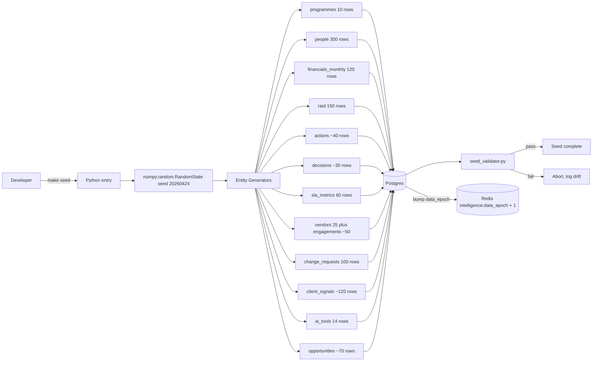
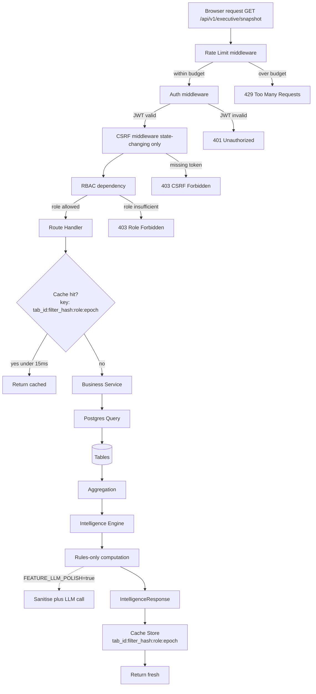
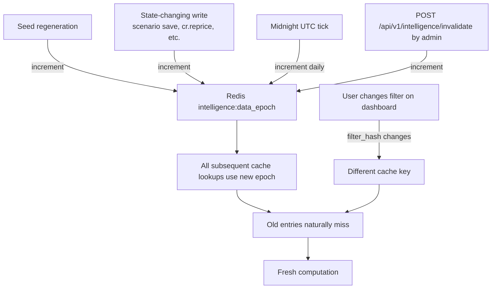
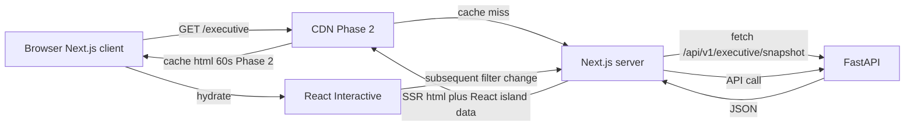
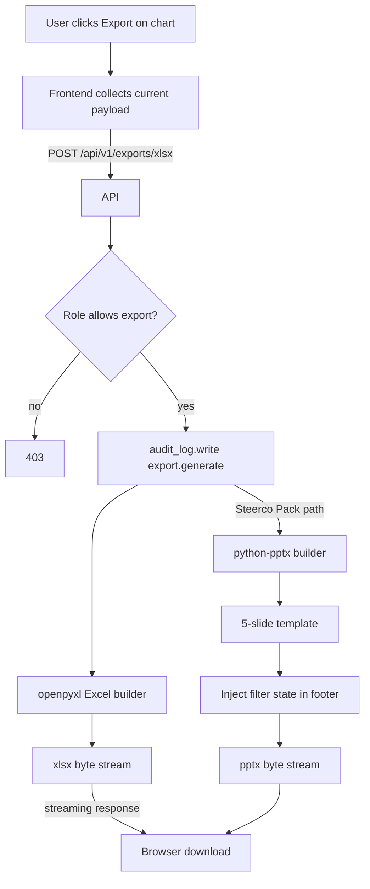
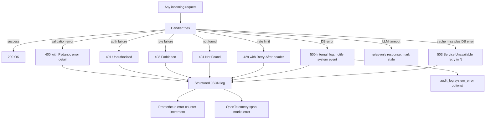

# 03_Data_Flow_Diagrams.md
### AKB1 Delivery Command Center v1 | Data Flow Diagrams | Created: 2026-04-24

> Visualises ingest, transform, serve, cache invalidation, export, and snapshot flows. Revision 2 bakes in the cache epoch invalidation pattern from Intelligence Layer PRD section 8.

---

## 1. Scope

Five flow diagrams covering every path data takes through the system. Mermaid format so GitHub renders them natively when the repo flips public.

## 2. Ingest flow (seed generator)

Phase 1 is seed only. Real ingestion from Jira, Salesforce, Workday, ServiceNow is Phase 2 and out of v1.0.0 scope.



Seed determinism: byte-identical output across machines. Validator asserts row counts, state distribution, financial shape. Any drift fails CI.

## 3. Transform flow (API request lifecycle)



## 4. Cache invalidation flow (D-017 severity-1 fix)

Cache key formula: `tab_id:filter_hash:role:data_epoch`. Epoch is monotonically increasing integer in Redis at key `intelligence:data_epoch`.



Old cache entries remain in Redis until TTL expiry (60 min safety net) or LRU eviction. They never get served again because the epoch has moved on.

## 5. Serve flow (frontend to backend)



Cache cascade: CDN for static and SSR HTML (Phase 2), Redis for API responses (Phase 1 and 2), browser for hydrated React state. Three layers of caching, each with explicit invalidation.

## 6. Export flow



Every export writes an audit_log row. No server-side persistence of the generated file. If operator needs retention, they re-export.

## 7. Snapshot flow (history PRD 21)

```mermaid
flowchart TB
  Cron[Sunday 23:59 UTC cron] --> Job[snapshot_job.py]
  Job --> Loop[For each tab_id in all 15 tabs]
  Loop --> Primary[For each primary filter slice]
  Primary --> Compute[Compute KPI payload plus intelligence drivers]
  Compute --> Serialise[jsonb serialise]
  Serialise --> Insert[INSERT kpi_snapshots tab_id, filter_hash, payload, captured_at]
  Insert --> Dedup[ON CONFLICT do nothing]
  Dedup --> Loop
  Loop -->|complete| Anomaly[Anomaly detection week over week]
  Anomaly -->|threshold breach| Notify[notifications.insert anomaly_*]
  Anomaly --> Done[Snapshot run complete]
  UserSelect[User picks past date in UI] --> Query[GET /api/v1/history/{tab_id}/as-of/{date}]
  Query --> Lookup[SELECT from kpi_snapshots]
  Lookup -->|found| Render[Render historical view with banner]
  Lookup -->|not found| Fallback[Nearest prior snapshot with note]
```

Snapshot job is idempotent via `(tab_id, filter_hash, captured_at)` unique constraint. Retention 52 weeks minimum per Security PRD data retention policy.

## 8. Error propagation



## 9. Non-functional envelope

Every flow in this document is bounded by the performance targets in Master PRD section 4. If a flow does not fit the envelope, the flow is redesigned, not the envelope relaxed.

---

*Owner: Claude. Signoff: Adi. Diagrams render natively on GitHub when repo flips public.*
