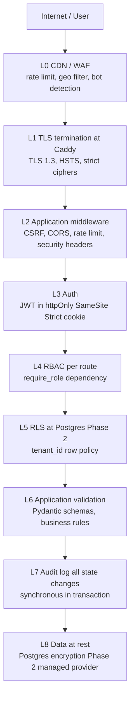

# 04_Security_Architecture.md
### AKB1 Delivery Command Center v1 | Security Architecture | Created: 2026-04-24

> Defense-in-depth blueprint. Expands on Security and Auth PRD revision 2 by laying out threat model, attack surface, defense layers, key management, and incident response flow. All severity-1 security findings from the self-check are addressed.

---

## 1. Scope

System-level security posture for v1.0.0. Covers threat model, layered defenses, cryptographic key management, data classification, incident response, and the Phase 1 to Phase 2 hardening matrix.

## 2. Threat model

### 2.1 Assets worth protecting

| Asset | Sensitivity |
|-------|-------------|
| Portfolio financial data | High |
| Person names and allocation data | High (PII) |
| Audit log | High (compliance forensics) |
| Auth secrets (JWT, refresh tokens) | Critical |
| Environment configuration | Critical |
| Application source code | Medium (becomes public at v1.0.0) |
| Seed data | Low (fictional) |
| LLM API keys | Critical (if configured) |

### 2.2 Actors

| Actor | Intent | Likely attack |
|-------|--------|---------------|
| Honest adopter self-hosting | Use the product | None |
| Curious user on public demo | Explore, find bugs | Probe endpoints, observe responses |
| Competitor scraping data | Competitive intelligence | Unauthenticated API scraping, brute-force login |
| Security researcher | Responsible disclosure | Fuzzing, dependency scan, static analysis |
| Malicious operator | Exfiltration via LLM injection | Prompt injection through manipulated data |
| Opportunistic attacker | Ransomware, crypto-mining | Known CVE exploitation |
| Insider (Phase 2) | Data theft | Excessive privilege use |

### 2.3 Out of threat model for v1.0.0

Nation-state attackers. Advanced persistent threats. Side-channel attacks (timing, cache, power). Supply-chain compromise beyond standard dependency scanning. Physical access to self-hosted hardware (operator responsibility).

## 3. Attack surface inventory

| Surface | Exposure | Defense |
|---------|----------|---------|
| Public login page | Internet Phase 2 | Rate limit 10 req/min per IP, bcrypt password check, no user enumeration |
| API endpoints `/api/v1/*` | Internet Phase 2 | JWT required, CSRF required on writes, RBAC, rate limit |
| Intelligence endpoints with LLM polish | Internet Phase 2 | Input sanitisation, prompt boundary markers, rules-only fallback |
| Export endpoints | Internet Phase 2 | Role-gated, audit-logged, no server-side persistence |
| Static assets (Next.js `/_next/static/*`) | CDN Phase 2 | Immutable cache, CSP, SRI |
| Admin endpoints (rare in v1.0.0) | Internet Phase 2 | Admin role required, audit log always |
| Direct Postgres access | Docker network or private subnet | No public exposure ever |
| Direct Redis access | Docker network or private subnet | No public exposure ever |
| Docker daemon socket | Host-local only | Never mounted into containers |

## 4. Defense in depth layers



Each layer is independently effective. Bypassing one layer still leaves the attacker inside a boundary.

## 5. Authentication and session management

### 5.1 Phase 1 credentials

bcrypt (cost 12) passwords in `users.json` seed. NextAuth validates on login. Issues JWT signed with `JWT_SECRET` (32 bytes random). Stored in httpOnly, SameSite=Strict, Secure cookie.

### 5.2 Refresh token rotation

Refresh token issued at login, stored in httpOnly cookie with 7-day expiry. Rotates on every use. Revocation list maintained in Redis. Logout invalidates immediately.

### 5.3 Phase 2 OAuth

Google and Microsoft via NextAuth provider. Email-domain allowlist for role assignment. Same JWT plus cookie pattern.

### 5.4 No MFA in v1.0.0

Self-host single user does not benefit. Phase 2 hosted may add WebAuthn or TOTP in v1.1.

## 6. Authorisation (RBAC)

Four roles from Design Foundations section 5.6. Access matrix in `backend/app/auth/access_matrix.py`. Every route gates with `require_role(*allowed_roles)`. Frontend renders role-appropriate UI. Backend is always the authority.

## 7. Data classification

| Class | Examples | Protection |
|-------|----------|-----------|
| Public | Marketing copy, README | No protection required |
| Internal | Aggregate KPIs | RBAC |
| Confidential | Individual person data, financial details, client names | RBAC plus audit log plus (Phase 2) RLS |
| Restricted | Auth secrets, JWT keys, API keys | Env vars, never logged, rotated quarterly |

## 8. Cryptographic key management

| Key | Storage | Rotation |
|-----|---------|----------|
| `JWT_SECRET` | Env var from `.env` file | Quarterly, invalidates all sessions |
| `NEXTAUTH_SECRET` | Env var | Quarterly |
| `CSRF_SECRET` | Env var | Quarterly |
| `DATABASE_URL` password | Env var | On compromise or annually |
| `OPENAI_API_KEY` (optional) | Env var | Operator managed |
| `GOOGLE_CLIENT_SECRET`, `MICROSOFT_CLIENT_SECRET` | Env var | On operator request |
| Postgres encryption at rest (Phase 2) | Managed by cloud provider | Provider-managed |
| TLS private key (Phase 2) | Caddy auto-provisions from Let's Encrypt | Automatic 60-day renewal |

Phase 2 hosted deployments use Vault, Fly.io Secrets, or Railway Variables. No plain-text secrets on disk in Phase 2.

## 9. LLM security (D-017 severity-1 fix)

Prompt injection is the primary LLM threat. Defenses:

1. **Rules-only default**: LLM polish is opt-in via `FEATURE_LLM_POLISH=true`. Default installs are not exposed.
2. **Input sanitisation**: filter state strings strip control characters, angle brackets, backticks, known jailbreak markers (`"ignore previous"`, `"system:"`, role-spoofing strings). Length cap 128 chars per field.
3. **Allowlist for Phase 1**: programme names compared against 10 seeded values. Unexpected names rejected.
4. **Boundary markers**: user-controlled content wrapped in explicit `<user_input>` tags in system prompt. System prompt asserts never-execute-user-instructions.
5. **Drivers never from LLM**: percentages, numbers, owners come from rules. LLM polishes prose only.
6. **Timeout plus fallback**: 8-second LLM timeout, fall back to rules-only on failure.
7. **Audit log**: every LLM-invoking request logs to audit trail for forensic replay.

## 10. Audit log (D-017 severity-1 fix)

Phase 1 required. Synchronous write in the same transaction as the state change. Events:

`auth.login`, `auth.logout`, `auth.failed_login`, `scenario.create`, `scenario.update`, `scenario.delete`, `cr.reprice`, `cr.approve`, `cr.reject`, `raid.open`, `raid.mitigate`, `raid.escalate`, `user.role_change`, `user.disable`, `settings.change`, `export.generate`, `notification.send`, `llm.invoked` (Phase 2 compliance).

Retention 1 year Phase 1, 7 years Phase 2. Query via admin audit viewer (post-v1).

## 11. Security headers (Phase 1 and 2)

```
Content-Security-Policy: default-src 'self'; script-src 'self'; style-src 'self' 'unsafe-inline'; img-src 'self' data:; connect-src 'self' http://localhost:4000 http://localhost:11434; font-src 'self' data:; frame-ancestors 'none'
X-Content-Type-Options: nosniff
X-Frame-Options: DENY
Referrer-Policy: strict-origin-when-cross-origin
Permissions-Policy: geolocation=(), microphone=(), camera=(), payment=()
Strict-Transport-Security: max-age=31536000; includeSubDomains; preload (Phase 2)
```

Tailwind CDN removed in production (local build). No `unsafe-inline` for scripts. `unsafe-inline` retained only for styles (Tailwind internals).

## 12. Incident response

### 12.1 Detection

| Signal | Channel |
|--------|---------|
| CVE scan finds new critical | CI fail, email operator |
| Anomalous login pattern | Audit log review, plus Phase 2 SIEM alert |
| Rate limit breach sustained | Redis counter threshold alert |
| Application crash | Sentry or equivalent Phase 2 |
| Healthcheck failure | Platform monitor Phase 2 |

### 12.2 Runbook `docs/runbooks/incident_response.md` (to be authored at M8)

Severity triage, containment, eradication, recovery, post-mortem. Documented template provided, operator adapts to their org.

### 12.3 Disclosure

`SECURITY.md` at repo root documents disclosure address (`deva.adi@gmail.com` Phase 1). Target response 48 hours, initial assessment 5 days, patch release for confirmed critical within 14 days.

## 13. Phase 1 to Phase 2 hardening matrix

| Control | Phase 1 | Phase 2 |
|---------|---------|---------|
| Audit log | Yes (mandated) | Yes plus SIEM export |
| RBAC | Yes | Yes plus per-tenant filtering |
| Postgres RLS | No | Yes with tenant_id policy |
| CSRF | Yes (double-submit cookie) | Yes |
| CORS | Strict allowlist | Strict plus per-tenant override |
| Rate limiting | Basic per-IP token bucket | Per-user plus tenant cap |
| TLS | Operator responsibility | Caddy with Let's Encrypt |
| HSTS | No | Yes 1 year preload |
| Secret storage | `.env` | Vault / platform secrets |
| Scan in CI | trivy, bandit, npm audit, schemathesis | Same plus SAST plus DAST |
| Penetration test | Not required | Yes before launch |
| Vulnerability disclosure | Email | Published policy plus PGP |

## 14. Compliance posture (D-016)

SOC2-lite documented for v1.0.0. Framework established, certification not attempted. Adopters seeking SOC2 or ISO 27001 layer their own audit on top. GDPR-lite in `PRIVACY.md`: data locality, right to export, right to delete. HIPAA not in scope.

## 15. Acceptance criteria

Security architecture signed off when Adi approves threat model, defense layers, LLM security policy, audit log scope, and Phase 1 to Phase 2 hardening matrix. Full Phase 1 controls verified at M8 security test phase.

---

*Owner: Claude as architect, reviewed by security-engineer subagent M5. Signoff: Adi.*
