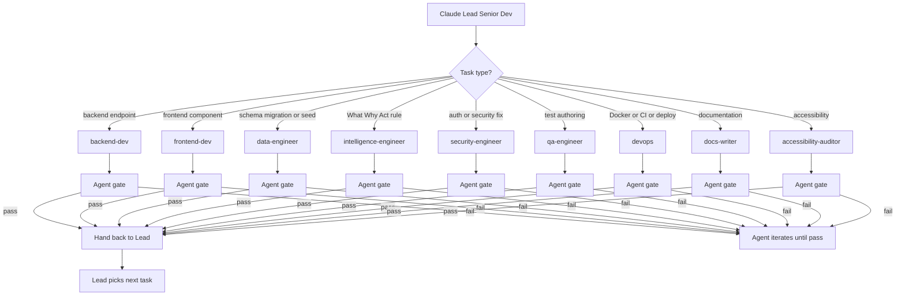

# 06_Multi_Agent_Dev_Strategy.md
### AKB1 Delivery Command Center v1 | Multi-Agent Development Strategy | Created: 2026-04-24

> Nine specialist subagents in `.claude/agents/`. Each has scope, tool surface, regression gates. Defines the delegation pattern for M6 onward when Claude Code takes over from Cowork.

---

## 1. Scope

M5 deliverable: nine subagent markdown files written to `.claude/agents/`. M6 onward: Claude Code orchestrates these subagents per milestone. This document is the spec.

## 2. Philosophy

Each subagent is a narrowly scoped specialist. They have access to the tools they need and nothing more. They enforce their own quality gates before handing control back to the orchestrator (Claude as lead senior dev).

## 3. Subagent roster

### 3.1 backend-dev

| Attribute | Value |
|-----------|-------|
| Scope | FastAPI routes, Pydantic schemas, SQLAlchemy models, business services, OpenAPI generation |
| Primary tools | Read, Write, Edit, Grep, Bash |
| Gate on handback | pytest 100 percent pass, OpenAPI regenerated, no flake8 errors, type check clean |
| Milestones | M6 heavy, M8 bug fix |

### 3.2 frontend-dev

| Attribute | Value |
|-----------|-------|
| Scope | Next.js App Router pages, React components, Tailwind styles, API client hooks, state management |
| Primary tools | Read, Write, Edit, Grep, Bash |
| Gate on handback | Vitest 100 percent pass, TypeScript type check clean, lint clean, Storybook or component isolation green |
| Milestones | M7 heavy, M8 bug fix |

### 3.3 data-engineer

| Attribute | Value |
|-----------|-------|
| Scope | Seed generator, Alembic migrations, fixtures, data quality checks, snapshot job |
| Primary tools | Read, Write, Edit, Grep, Bash |
| Gate on handback | Seed validator passes, migration reversible for dev, data quality rules all green, snapshot job idempotent |
| Milestones | M6 medium, M7 light, M8 light |

### 3.4 intelligence-engineer

| Attribute | Value |
|-----------|-------|
| Scope | What Why Act engine, per-tab rule files, LLM integration with sanitisation, cache epoch logic |
| Primary tools | Read, Write, Edit, Grep, Bash |
| Gate on handback | All 15 rule files exist, voice test passes, injection tests pass, cache invalidation tests pass |
| Milestones | M6 medium, throughout |

### 3.5 security-engineer

| Attribute | Value |
|-----------|-------|
| Scope | Auth, RBAC, CSRF, CORS, rate limiting, audit log, secrets management, scanners |
| Primary tools | Read, Write, Edit, Grep, Bash |
| Gate on handback | trivy, bandit, npm audit, schemathesis all green. No critical or high findings. Security headers verified. Audit log writes observable |
| Milestones | M6 medium, M8 heavy |

### 3.6 qa-engineer

| Attribute | Value |
|-----------|-------|
| Scope | pytest scenarios, Vitest scenarios, Playwright E2E, drill integrity suite, contract tests with schemathesis |
| Primary tools | Read, Write, Edit, Grep, Bash |
| Gate on handback | All test suites green, drill integrity 100 percent, contract test green, coverage 80 percent minimum |
| Milestones | M6 light, M7 medium, M8 heavy |

### 3.7 devops

| Attribute | Value |
|-----------|-------|
| Scope | Dockerfiles, docker-compose, Makefile, CI workflows, deployment manifests, observability stack |
| Primary tools | Read, Write, Edit, Grep, Bash |
| Gate on handback | Docker images build and run, CI workflow green, deploy to preview works, observability endpoints respond |
| Milestones | M6 light, M8 heavy, M9 ship |

### 3.8 docs-writer

| Attribute | Value |
|-----------|-------|
| Scope | README, PRDs, architecture docs, release notes, LinkedIn launch kit, wireframe copy |
| Primary tools | Read, Write, Edit |
| Gate on handback | No em dashes, no emojis, voice compliance, cross-references valid, markdown renders clean |
| Milestones | Throughout |

### 3.9 accessibility-auditor

| Attribute | Value |
|-----------|-------|
| Scope | axe-core integration, WCAG AA compliance, keyboard nav, colour contrast, screen reader |
| Primary tools | Read, Edit, Bash |
| Gate on handback | axe-core zero WCAG AA violations. Keyboard navigation complete on every tab. Colour contrast verified |
| Milestones | M7 medium, M8 heavy |

## 4. Orchestration pattern

Claude (lead senior dev, acting as orchestrator in Claude Code) decides which subagent to delegate to based on the milestone and task type.



## 5. Subagent spec file template (`.claude/agents/agent-name.md`)

Each of the nine files follows this structure:

```markdown
# <agent-name>
### Specialist role: <summary>

> Inherit from: CLAUDE.md project rules. Apply these rules in every action.

## Mission
One paragraph.

## Scope
What this agent owns. What it does not touch.

## Tool surface
Which tools this agent may use and why.

## Hard rules specific to this agent
List.

## Quality gates (regression)
Checklist the agent must pass before returning control.

## Common tasks
Examples of typical task assignments.

## Handback contract
What the orchestrator receives when this agent finishes.
```

## 6. Delegation examples

### 6.1 M6 example

Lead task: "Implement `/api/v1/executive/snapshot` endpoint per PRD 04."

Lead delegates to `backend-dev` with context: PRD 04 revision 2, Data Model PRD revision 2 schema, OpenAPI spec target. `backend-dev` writes route, service, schema, test. Runs gate. Hands back.

Lead then delegates to `qa-engineer` with context: "Write Playwright test for Executive tab loading with Portfolio Owner role." `qa-engineer` writes test, runs, hands back.

Lead then delegates to `docs-writer` with context: "Update `docs/state/BUILD_STATE.md` reflecting Executive endpoint shipped."

### 6.2 M8 example

Lead task: "axe-core finds 3 WCAG AA violations on Risk and RAID heatmap."

Lead delegates to `accessibility-auditor` with context: axe output, wireframe v1_03, PRD 06. Auditor fixes, re-runs axe, gate green, hands back.

## 7. Gate enforcement

Agent gates are mechanical. Orchestrator checks before allowing the agent to finalise:

| Gate | Check |
|------|-------|
| Test pass | `make test-<scope>` returns 0 |
| Lint | `make lint` returns 0 |
| Type check | TypeScript `tsc --noEmit` or mypy returns 0 |
| Coverage | Threshold met |
| Security | trivy plus bandit no critical/high |
| Accessibility | axe-core zero WCAG AA violations |
| Voice | em dash scanner plus emoji scanner pass |
| Contract | OpenAPI diff vs PRD tables no drift |

Failing a gate means the agent iterates. No manual override.

## 8. Communication between agents

Agents do not communicate directly. All handoff goes through the orchestrator. This keeps scope boundaries clean and makes debugging predictable.

## 9. Regression-gate enforcement per milestone

| Milestone | Gates that must close |
|-----------|----------------------|
| M6 backend ready | pytest 80 percent coverage, OpenAPI spec validated, contract tests green |
| M7 frontend ready | Vitest 80 percent coverage, axe-core zero violations |
| M8 integration | Playwright 100 percent pass, drill integrity 100 percent, Locust benchmark green at 100 and 500 concurrent, security scan green |
| M9 release | All above plus CHANGELOG, release notes, LinkedIn launch kit ready |

## 10. Acceptance criteria

Multi-agent dev strategy signed off when Adi approves the nine roles, their scopes, and the orchestration pattern. Nine subagent markdown files authored at M5 using this spec.

---

*Owner: Claude. Signoff: Adi. Cascades to `.claude/agents/*.md` at Milestone M5.*
